# Proyecto final

La estructura de directorios para este proyecto es

El sitio será un tripa visor de la comuna de Quilicura, donde se expondrá los lugares típicos de la comuna y aquellos donde se pueden disfrutar en familia, buscando redescubrir la comuna.

El sitio será enfocado a personas entre 25 a 50 años, con grupos familiares, que busque una actividad entretenida para disfrutar en familia sin salir de la comuna.

Se quiere que el sitio sea claro para encontrar lo que se busca, tanto en el pc como en el dispositivo móvil.
Contará con una barra con botones que al cliclearlos los llevaran a las diferentes páginas:

  index 

arte callejero

 arquitectura

 y gastronomía.

En índex encontrará el mapa del sitio, una reseña del departamento de turismo, algunos lugares destacados, etc.

En Arte callejero se encontraran las expresiones artísticas de quilicuranos, las cuales se extienden por toda la comuna y alguna referencia a ellos.

En Arquitectura se destacan edificios sobresalientes, ya sea por su diseño, historia o dato relevante.

En gastronomía ser hará un recorrido por las mejores picas de la comuna.

Al entrar a la pagina el usuario se encontrará con una barra superior, fija que al ser responsiva cambiara a una hamburgesa, con el logo de la comuna en el lado izquierdo, la que incluye:

-índex

-arte callejero

-arquitectura

-gastronomía

Los colores elegidos para la página son:

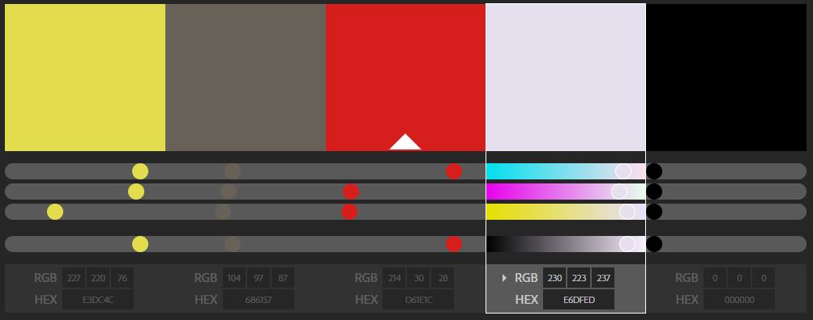

En el índex los artículos estarán en grillas de forma clara, destacando los más relevantes al comienzo de la página.

Se usará en el diseño de la página, grillas, jumbotron, carrusel, imágenes, footer, botones, nav, navbar, logos,  cartas, etc.

Se requiere que el sitio sea agradable a la vista, fácil de navegar, con información clara, precisa, que recove la información necesaria para cautivar al visitante con los encantos de la comuna, y que permita que el quilicurano se sienta orgulloso de su comuna y quiera visitar los lugares de los que dispone cerca de su hogar.

El sitio usara un Layout de blog.

El boceto de la pagina de inicio será:

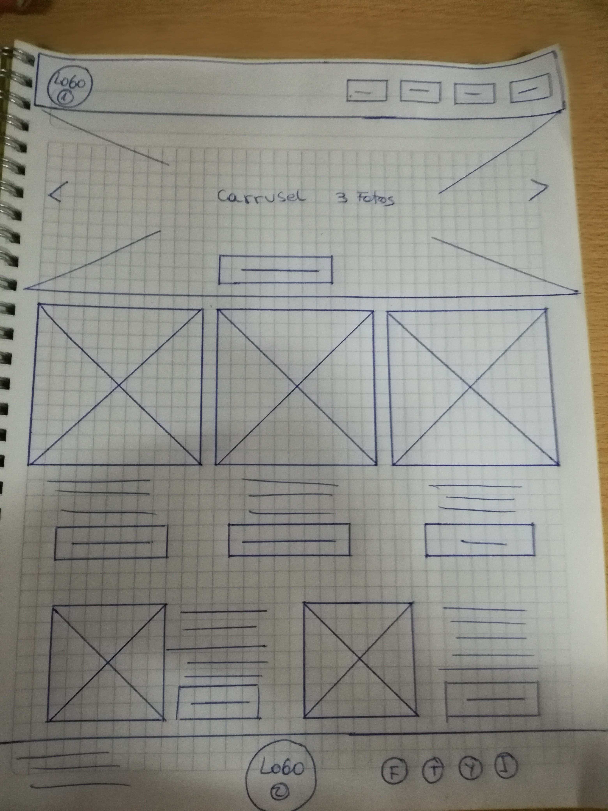
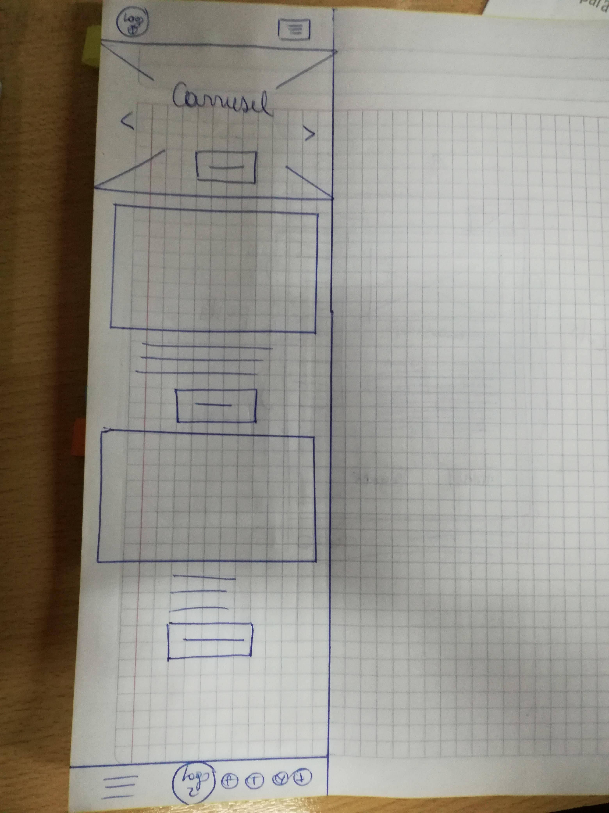

El boceto de la pagina de Gaastronomía será:

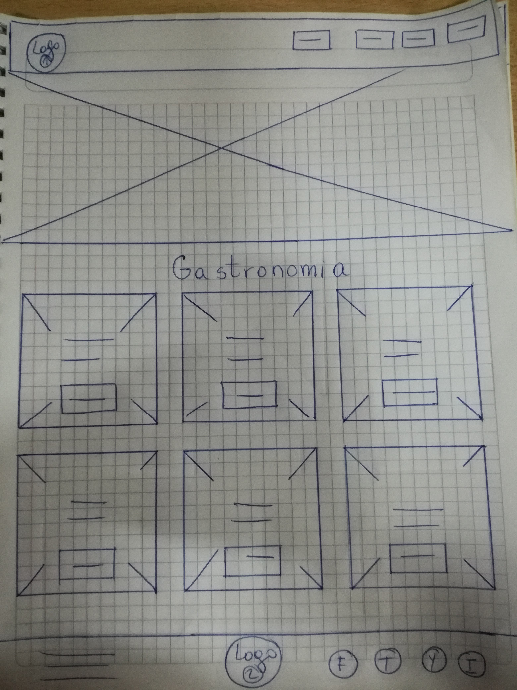
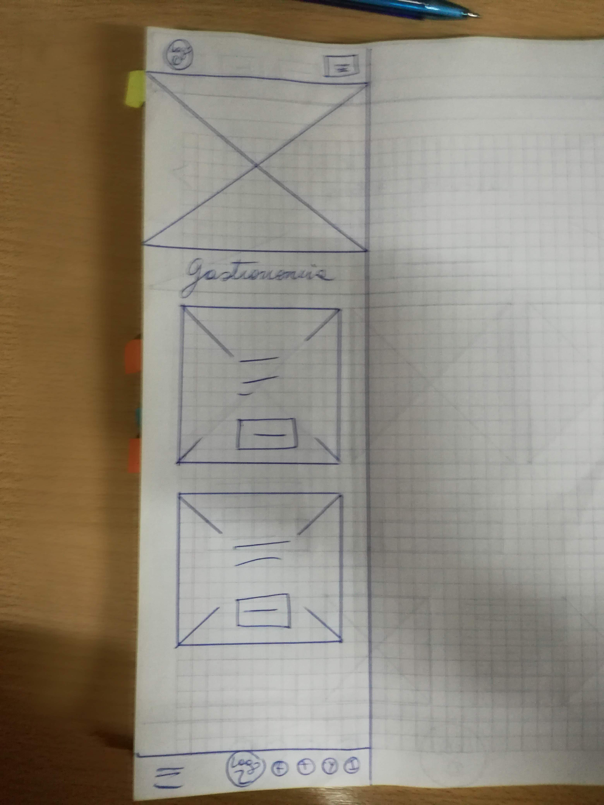

El boceto de la pagina de Arte Callejero será:

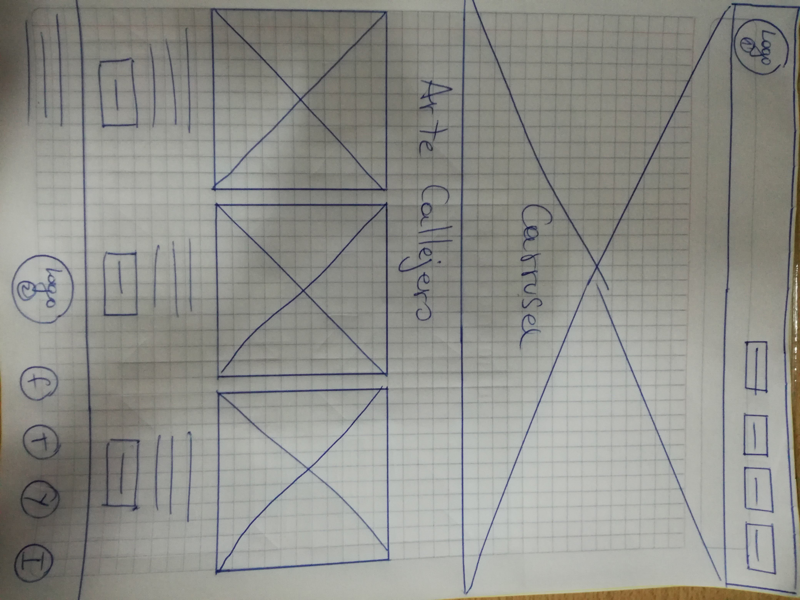
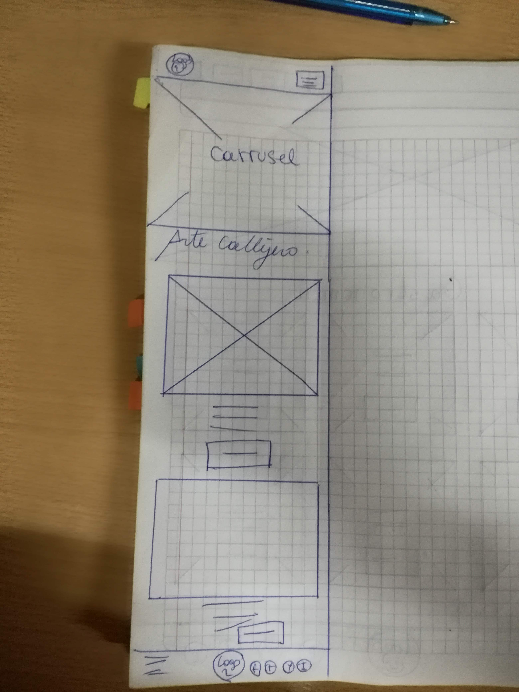

El boceto de la pagina de Arquitectura será:

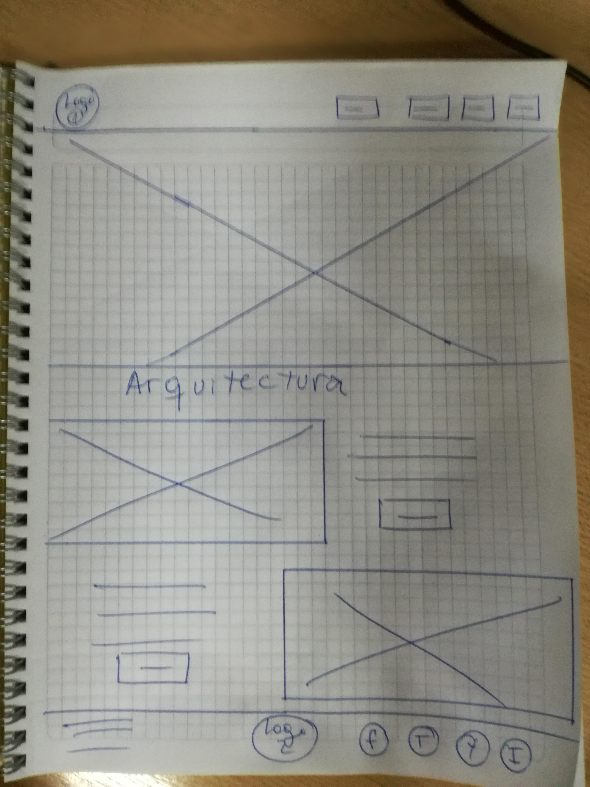
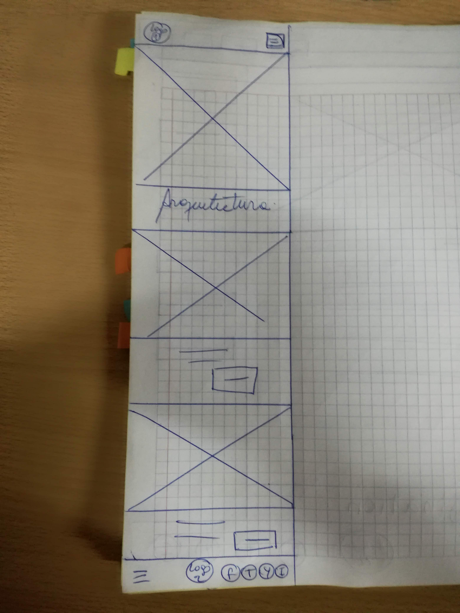

El boceto de la pagina de los articulos será:

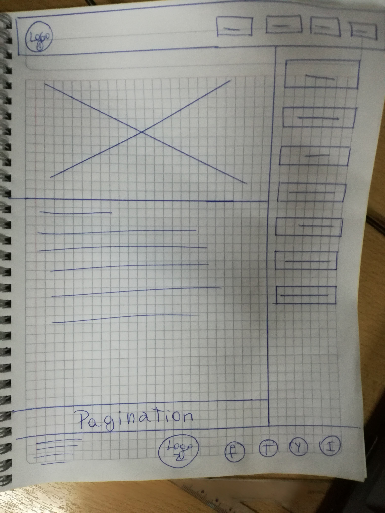
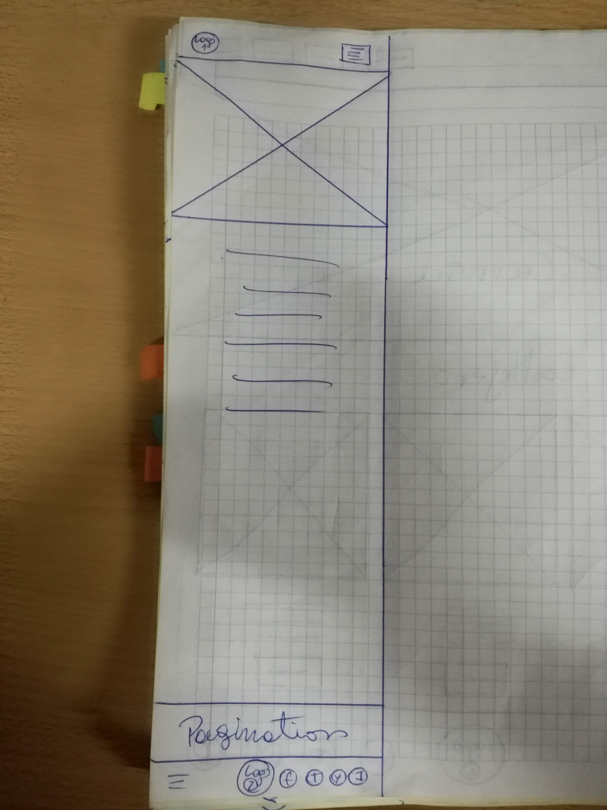

